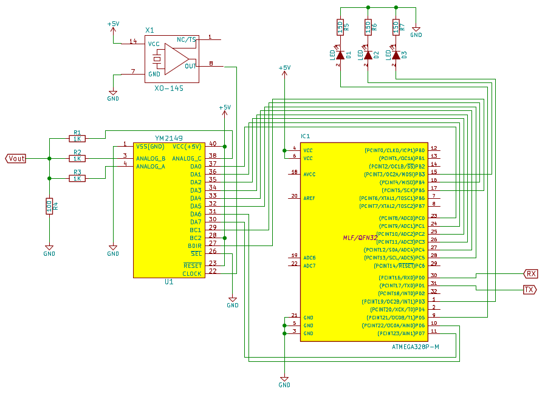
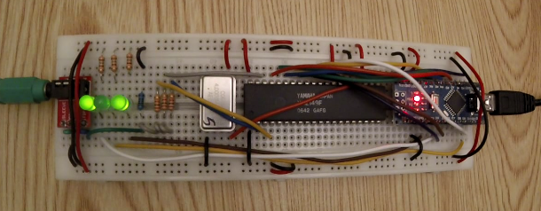

Title: ym2149-sndh

Atmega 328P Firmware code + Python scripts to play YM and SNDH files
on the YM2149.

To build the and flash the firmware:

    $ make flash

The repository includes a couple of scripts:

* `stream-ym.py` to play YM files on the YM2149 chip
* `stream-sndh.py` to play SNDH files on the YM2149 chip
* `stream-sndh-2.py` to play SNDH files on the YM2149 chip.

The `stream-sndh-2.py` is faster than `stream-sndh.py` but consumes
more CPU. It can be useful to play some 'digi' sounds.

Not all SNDH files are currently supported. More optimization would be
required.

The design supported is the following one:

The following table provides the wiring:

| Other | YM2149F name | YM2149F pin# | Board pin | ATmega328P pin# | ATmega328P name |
|-------|--------------|--------------|-----------|-----------------|-----------------|
|       | DA0          | 37           | A0        | 23              | PC0             |
|       | DA1          | 36           | A1        | 24              | PC1             |
|       | DA2          | 35           | A2        | 25              | PC2             |
|       | DA3          | 34           | A3        | 26              | PC3             |
|       | DA4          | 33           | A4        | 27              | PC4             |
|       | DA5          | 32           | A5        | 28              | PC5             |
|       | DA6          | 31           | D6        | 10              | PD6             |
|       | DA7          | 30           | D7        | 11              | PD7             |
|       | BC1          | 29           | D12       | 16              | PB4             |
| VCC   | BC2          | 28           |           |                 |                 |
|       | BDIR         | 27           | D13       | 17              | PB5             |
| GND   | ^SEL         | 26           |           |                 |                 |
| LED0  |              |              | D3        |  1              | PD3             |
| LED1  |              |              | D11       | 15              | PB3             |
| LED2  |              |              | D5        |  9              | PD5             |
| CHAN0 | ANALOG A     | 4            |           |                 |                 |
| CHAN1 | ANALOG B     | 3            |           |                 |                 |
| CHAN2 | ANALOG C     | 38           |           |                 |                 |
| CLOCK | CLOCK        | 22           |           |                 |                 |
| TIP   | AN ABC       |              |           |                 |                 |
| RING1 | AN ABC       |              |           |                 |                 |
| RING2 | VSS(GND)     | 1            |           |                 |                 |
| SLEEVE| VSS(GND)     | 1            | GNDx      |                 |                 |
|       | VCC          | 40           | 5V        |                 |                 |

A video of the [YM2149 playing a Relix tune][1] is available on Youtube.

[1]: https://www.youtube.com/watch?v=JjofS8wdNEY
